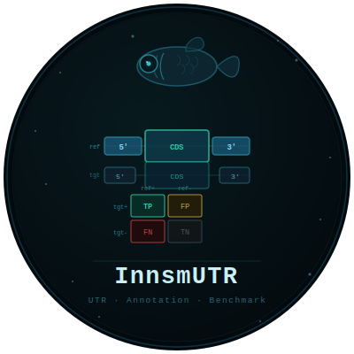

# InnsmUTR

<p align="center">
  
</p>

<p align="center">
  
  
  
</p>

<p align="center">
  <a href="CHANGELOG.md">Changelog</a>
</p>

A toolkit for UTR annotation in eukaryotic genome projects, with two
complementary scripts:

| Script | Purpose |
|---|---|
| **`InnsmUTR.py`** | *Add* UTRs to a genome annotation using full-length transcript evidence |
| **`compare_utr_annotation.py`** | *Benchmark* a UTR-annotated GFF3 against a reference / gold-standard |

> **Name:** Lovecraft Mythos convention — *Innsmouth* (city of deep-sea
> hybrids) + *UTR* (Untranslated Region). Untranslated but essential, lurking
> at the edges of every gene model.

---

## InnsmUTR.py — Adding UTRs

### How it works

1. Align transcript sequences (cDNA, IsoSeq, Trinity/StringTie assemblies)
   to the genome with **minimap2** or **GMAP**.
2. Parse SAM CIGAR strings to recover per-transcript exon blocks.
3. Match each mRNA's CDS extent to overlapping aligned transcripts; select
   the best-scoring alignment (identity × coverage, with a bonus for
   transcripts that extend beyond the CDS).
4. Clip transcript exon blocks at the CDS boundaries to derive 5' and 3'
   UTR intervals; filter by `--min_utr_len` / `--max_utr_len`.
5. Reproduce the input GFF3, inserting `five_prime_utr` / `three_prime_utr`
   features after each mRNA and updating gene/mRNA coordinates where UTRs
   extend beyond existing boundaries.
6. mRNAs that already carry UTR features in the input GFF3 are skipped
   automatically.

### Requirements

```bash
conda env create -f envs/innsmutr.yaml
conda activate innsmutr
```

| Package / Tool | Channel | Used by |
|---|---|---|
| `minimap2` | bioconda | Alignment (default aligner) |
| `gmap` | bioconda | Alignment (alternative) |
| `codecarbon` | conda-forge | Carbon footprint tracking (optional) |
| `bedtools` / `pybedtools` | bioconda | compare_utr_annotation.py only |
| `pandas` | conda-forge | compare_utr_annotation.py only |

> `codecarbon` is optional — the pipeline runs normally without it; the
> carbon footprint section of the report will simply be absent.

### Usage

```
InnsmUTR.py --gff3 annotation.gff3 --genome genome.fa --transcripts tx.fa
            --output utr_run/
            [--aligner minimap2|gmap]
            [--threads 4]
            [--min_utr_len 10]  [--max_utr_len 5000]
            [--min_coverage 0.80]  [--min_identity 0.95]
            [--disable_co2_tracking]
            [--force]
```

### Options

| Flag | Default | Description |
|---|---|---|
| `--gff3` | required | Input genome annotation (GFF3) |
| `--genome` | required | Reference genome FASTA |
| `--transcripts` | required | Transcript FASTA (cDNA, IsoSeq, Trinity, StringTie) |
| `--output` | required | Output directory (created if absent; `results/`, `workdir/`, `logs/` are created inside) |
| `--aligner` | `minimap2` | Splice-aware aligner: `minimap2` or `gmap` |
| `--threads` | `4` | CPU threads |
| `--min_utr_len` | `10` | Minimum UTR length in bp to add |
| `--max_utr_len` | `5000` | Maximum UTR length in bp to add |
| `--min_coverage` | `0.80` | Minimum transcript alignment coverage |
| `--min_identity` | `0.95` | Minimum alignment identity |
| `--disable_co2_tracking` | off | Disable carbon footprint tracking even if `codecarbon` is installed |
| `--force` | off | Rerun all steps from scratch even if intermediate outputs exist in `workdir/` |

### Output directory layout

`--output utr_run` creates:

```
utr_run/
├── results/
│   ├── mod01_alignment_utr_run.stats.tsv   Alignment summary statistics
│   ├── mod02_utr_utr_run.gff3              Updated GFF3 with UTR features
│   ├── mod02_utr_stats_utr_run.tsv         Per-mRNA UTR stats table
│   └── utr_run.run_summary.json            Run metadata and resource usage
├── workdir/
│   └── transcripts.sam                     Intermediate alignment file
│   └── gmap_db/                            GMAP database (--aligner gmap only)
└── logs/
    ├── Run_InnsmUTR.log                    Full run log (date, user, command, progress)
    └── utr_run.emissions.csv               Carbon footprint (requires codecarbon)
```

### Run log

`logs/Run_InnsmUTR.log` is written on every run and contains:

- Date and time, username, server hostname, and OS (system, release, architecture)
- The exact command used to invoke the script
- Timestamped progress messages from each step (same as stderr)
- Wall-clock runtime, peak RSS memory, and carbon footprint summary at the end

### Run summary (`run_summary.json`)

| Field | Description |
|---|---|
| `date` | Run timestamp |
| `version` | InnsmUTR version |
| `input_gff3` | Path to the input GFF3 |
| `input_genome` | Path to the reference genome |
| `input_transcripts` | Path to the transcript FASTA |
| `n_mrnas_total` | Total mRNAs in the input GFF3 |
| `n_mrnas_with_5utr` | mRNAs that received a new 5' UTR |
| `n_mrnas_with_3utr` | mRNAs that received a new 3' UTR |
| `parameters` | All threshold parameters used |
| `resource_usage.wall_clock_s` | Total wall-clock time (seconds) |
| `resource_usage.peak_mem_mb` | Peak RSS memory (MB) |
| `resource_usage.emissions_kg_CO2eq` | Carbon footprint (null if codecarbon not installed) |

### UTR stats table columns

| Column | Description |
|---|---|
| `mrna_id` | mRNA identifier |
| `gene_id` | Parent gene identifier |
| `chrom` | Chromosome / scaffold |
| `strand` | Strand (`+` or `-`) |
| `five_utr_bp` | Total 5' UTR length added (bp; 0 if none) |
| `five_utr_exons` | Number of 5' UTR exon blocks |
| `three_utr_bp` | Total 3' UTR length added (bp; 0 if none) |
| `three_utr_exons` | Number of 3' UTR exon blocks |
| `supporting_tx` | ID of the transcript used as UTR evidence |
| `aln_identity` | Alignment identity of the supporting transcript |
| `aln_coverage` | Alignment coverage of the supporting transcript |

### Checkpoint / resume behaviour

InnsmUTR checks whether `workdir/transcripts.sam` already exists before
running the aligner. Re-running the same command after an interrupted run
resumes from after the alignment step:

```
[checkpoint] minimap2 — transcripts.sam already exists, skipping
```

To force a full rerun from scratch:

```bash
InnsmUTR.py --gff3 annotation.gff3 --genome genome.fa \
            --transcripts tx.fa --output utr_run/ --force
```

### Carbon footprint

Written by [CodeCarbon](https://github.com/mlco2/codecarbon) when installed.

```bash
conda install -c conda-forge codecarbon    # enable tracking
```

```bash
InnsmUTR.py ... --disable_co2_tracking    # opt out per-run
```

### Notes

- **minimap2** is run with `-ax splice --secondary=no -C 5` (canonical
  splice-site penalty). This is appropriate for high-quality cDNA and
  short IsoSeq reads. Long noisy IsoSeq reads may benefit from
  `-ax splice:hq`; adjust by running minimap2 independently and supplying
  the resulting SAM via a future `--sam` flag.
- **GMAP** is run with `--format=samse --npaths=1`; the genome database is
  built automatically into `workdir/gmap_db/` on the first run and reused
  on subsequent runs.
- mRNAs that **already have UTR features** in the input GFF3 are skipped;
  only mRNAs without existing UTR annotations receive new ones.
- Multi-exon UTRs are fully supported — the transcript exon blocks are
  preserved intact, clipped only at the CDS boundary.
- If the new UTR extends beyond the current mRNA or gene coordinates, those
  features are updated in the output GFF3.

---

## compare_utr_annotation.py — Benchmarking UTRs

Benchmarking tool for UTR annotation. Compares a UTR-annotated GFF3 (e.g.
the output of `InnsmUTR.py` or a PASA run) against a reference /
gold-standard GFF3, and reports presence and boundary-accuracy metrics for
5' and 3' UTRs.

### How it works

For each transcript, the 5' and 3' UTR length is read directly from the
explicit `five_prime_UTR` / `three_prime_UTR` feature lines in the GFF3,
summed per transcript so spliced (multi-exon) UTRs are counted correctly.
**This script does not derive UTRs from `mRNA`/`CDS`/`exon` spans** — if
your GFF3 only has `CDS` and `exon` records (no UTR features), run it
through [AGAT](https://github.com/NBISweden/AGAT) first to generate them,
then compare the AGAT output:

```bash
conda install -c bioconda agat
agat_convert_sp_gxf2gxf.pl -g your_annotation.gff3 -o your_annotation.utrs.gff3
```

Transcripts are matched between target and reference either by:
- **shared transcript ID** (default, `--match_by id`) — use when target and
  reference describe the same gene set
- **CDS-span overlap** (`--match_by overlap`) — use when IDs differ between
  annotations; requires `bedtools`/`pybedtools`

### Usage

```bash
# Match by shared transcript ID
python scripts/compare_utr_annotation.py \
    -t pasa_updated.gff3 -r reference.gff3 \
    --outdir comparisons/ --prefix arath --tolerance 20

# Match by CDS overlap (IDs differ between target and reference)
python scripts/compare_utr_annotation.py \
    -t pasa_updated.gff3 -r reference.gff3 \
    --match_by overlap --min_cds_overlap 0.9 \
    --outdir comparisons/ --prefix arath
```

### Options

| Flag | Default | Description |
|---|---|---|
| `-t, --target` | required | Target GFF3 (e.g. InnsmUTR or PASA output) |
| `-r, --reference` | required | Reference / gold-standard GFF3 |
| `--outdir` | required | Output directory |
| `--prefix` | required | Prefix for output file names |
| `--match_by` | `id` | `id` or `overlap` |
| `--id_attr` | `ID` | GFF3 attribute used as transcript ID |
| `--mrna_feature` | `mRNA` | GFF3 feature type for transcripts |
| `--min_cds_overlap` | `0.9` | Min fraction of reference CDS span covered, for overlap matching |
| `--tolerance` | `20` | UTR boundary tolerance in bp |

### Output

- `{prefix}_comparison.tsv` — one row per matched transcript: UTR length
  (ref/target), presence call (TP/FP/FN/TN), boundary offset in bp, and
  whether the offset is within tolerance, for each of 5' and 3' UTR.
- `{prefix}_metrics.tsv` — per side (5'/3'): TP/FP/FN/TN counts, precision,
  recall, F1 (presence-based), boundary accuracy rate, and mean/median
  boundary offset in bp.

---

## Third-party tools and citations

Please cite the following tools when using InnsmUTR in published work.

### minimap2

Fast pairwise sequence alignment for long reads and spliced cDNA sequences.

> Li H. (2018) Minimap2: pairwise alignment for nucleotide sequences.
> *Bioinformatics*, 34(18):3094–3100.
> doi: [10.1093/bioinformatics/bty191](https://doi.org/10.1093/bioinformatics/bty191)

Repository: https://github.com/lh3/minimap2

### GMAP

Accurate spliced alignment of cDNA and genomic sequences.

> Wu TD, Watanabe CK. (2005) GMAP: a genomic mapping and alignment program
> for mRNA and EST sequences. *Bioinformatics*, 21(9):1859–1875.
> doi: [10.1093/bioinformatics/bti310](https://doi.org/10.1093/bioinformatics/bti310)

Repository: https://github.com/juliangehring/GMAP-GSNAP

### CodeCarbon *(optional)*

Estimates and tracks CO₂ equivalent emissions and energy consumption of
computational workflows.

> Courty V, Schmidt V, Lottick K, et al. (2023) *CodeCarbon: Estimate and
> Track Carbon Emissions from Machine Learning Computing.*
> Zenodo. doi: [10.5281/zenodo.3634573](https://doi.org/10.5281/zenodo.3634573)

Repository: https://github.com/mlco2/codecarbon
